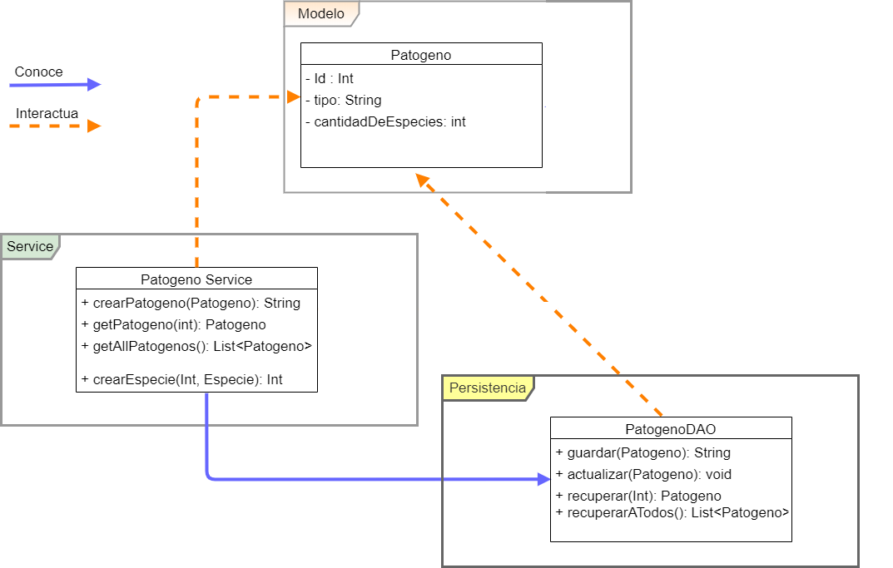

## Entrega 1 - JDBC

El líder del equipo de científicos del laboratorio con el cual nuestra compañía está trabajando se reúne con nosotros y nos comparte el conocimiento necesario para para comenzar con la implementación de nuestro simulador. Nos cuenta que se denomina patógeno a todo agente biológico externo que se aloja en un ente biológico, dañando de alguna manera su anatomía. Los patógenos pueden ser de varios tipos: Virus, bacterias, hongos entre otros. Y para cada tipo de patógeno existen varias especies conocidas: Gripe, Sarampión, Paperas son diferentes especies de virus. 

  

	
Se nos pide tener un módulo que nos permita administrar los diferentes tipos de patógenos posibles con sus características básicas (nombre, tipo) y donde puedan registrarse las diferentes especies conocidas para ese patógeno.
Luego de horas de discusión y planeamiento, el líder técnico llega a nosotros con la siguiente interfaz:

  

La interfaz `PatogenoDAO` declara los siguientes métodos que nosotros debemos implementar:

- `guardar(patogeno: Patogeno )` - Recibe un objeto `Patogeno` y se encarga de persistir en la base de datos. Tener en cuenta que el nombre de cada especie debe ser único para toda la aplicación.

- `actualizar(patogeno: Patogeno)` - Actualiza el Patogeno recibido por parámetro.

- `recuperar(nombredeDelPatogeno: Patogeno):Patogeno` - Este método devolverá la Patógeno cuyo nombre sea igual al provisto por parámetro. Se espera que este método devuelva, a lo sumo, un solo resultado.

- `recuperarTodos(): List<Patogeno>` - Este método deberá devolver una lista de todos los patógenos existentes ordenados alfabéticamente por su nombre en forma ascendente.

El equipo de front estara utilizando la interfaz  `PatogenoService`  para comunicarse con nuestro equipo. Este servicio debera implementar los siguientes metodos:

- `crearPatogeno(patogeno: Patogeno ): String` - Recibe un objeto `Patogeno` y se encarga de persistir en la base de datos. Tener en cuenta que el nombre de cada especie debe ser único para toda la aplicación.

- `getPatogeno(nombreDelPatogeno: String): Patogeno` - Actualiza el Patogeno recibido por parámetro.

- `getAllPatogenos(nombredeDelPatogeno: Patogeno): List<Patogeno>` - Este método deberá devolver una lista de todos los patógenos existentes ordenados alfabéticamente por su nombre en forma ascendente.

- `agregarEspecie(nombreDelPatogeno: String ): Int` - Debera sumar en uno la cantidad de especies existentes del Patogeno, y devolver ese numero.

Adicionalmente, el equipo de front end estará realizando test de integración que van a interactuar con nuestro `PatogenoService`. En dichos tests ellos darán uso a la siguiente interfaz, para la cual también deberemos proveer una implementación:
 
La interfaz `DataService` entiende dos mensajes:

- `deleteAll()` - Se espera que tras ejecutarse esto se elimine toda la información persistida en la base de datos, de manera de poder comenzar el siguiente tests desde cero.

- `crearSetDatosIniciales()` - Crea un set de datos iniciales (de momento solo objetos Patogeno) para facilitar las pruebas de frontend.

### Se pide:
- Que provean implementaciones para las interfaces descritas anteriormente, haciendo uso de todo lo visto en clase.
- Asignen propiamente las responsabilidades a todos los objetos intervinientes, discriminando entre servicios, DAOs y objetos de negocio.
- Creen test que prueben todas las funcionalidades pedidas, con casos favorables y desfavorables.
- Provean un archivo .sql con las sentencias DDL que sean necesarias para crear el schema de la base de datos (create tables).

### Recuerden que:
- No pueden modificar las interfaces PatogenoDAO y DataService, solo implementarlas.
- Pueden agregar nuevos métodos y atributos a los objetos Patogeno y Especie, pero no eliminar o renombrar atributos / métodos ya provistos.